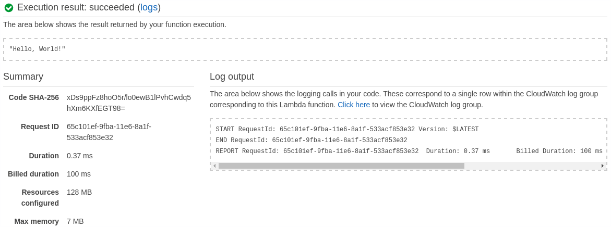

<a id="top" name="top"></a>

<p align="center"><b>THIS PROJECT IS DEPRECATED IN FAVOR OF ITS SUCCESSOR<br><a href="https://github.com/eawsy/aws-lambda-go-shim">eawsy/aws-lambda-go-shim</a></b></p><br><br>

[][aws-home]
[][eawsy-home]

# eawsy/aws-lambda-go

> A fast and clean way to execute Go on AWS Lambda.

[![Status][badge-status]](#top)
[![License][badge-license]](LICENSE)
[![Help][badge-help]][eawsy-chat]
[![Social][badge-social]][eawsy-twitter]

[AWS Lambda][aws-lambda-home] lets you run code without provisioning or managing servers. [For now][aws-lambda-lng], it 
only supports Node.js, Java, C# and Python. This project provides Go support *without spawning a process*.

[](#top)
## Preview

```sh
go get -u -d github.com/eawsy/aws-lambda-go/...
```

```go
package main

import (
  "encoding/json"

  "github.com/eawsy/aws-lambda-go/service/lambda/runtime"
)

func handle(evt json.RawMessage, ctx *runtime.Context) (interface{}, error) {
  return "Hello, World!", nil
}

func init() {
  runtime.HandleFunc(handle)
}

func main() {}
```

```sh
docker pull eawsy/aws-lambda-go
docker run --rm -v $GOPATH:/go -v $PWD:/tmp eawsy/aws-lambda-go
```

```sh
aws lambda create-function \
  --function-name preview-go \
  --runtime python2.7 --handler handler.handle --zip-file fileb://handler.zip \
  --role arn:aws:iam::AWS_ACCOUNT_NUMBER:role/lambda_basic_execution

aws lambda invoke --function-name preview-go output.txt
```

<kbd></kbd>

[](#top)
## Documentation

This [wiki][eawsy-wiki] is the main source of documentation for developers working with or contributing to the 
project.

[](#top)
## About

[][eawsy-home]

This project is maintained and funded by Alsanium, SAS.

[We][eawsy-home] :heart: [AWS][aws-home] and open source software. See [our other projects][eawsy-github], or 
[hire us][eawsy-hire-form] to help you build modern applications on AWS.

[](#top)
## Contact

We want to make it easy for you, users and contributers, to talk with us and connect with each others, to share ideas, 
solve problems and make help this project awesome. Here are the main channels we're running currently and we'd love to 
hear from you on them.

### Twitter 
  
[eawsyhq][eawsy-twitter] 

Follow and chat with us on Twitter. 

Share stories!

### Gitter 

[eawsy/bavardage][eawsy-gitter]

This is for all of you. Users, developers and curious. You can find help, links, questions and answers from all the 
community including the core team.

Ask questions!

### GitHub

[pull requests][eawsy-pr] & [issues][eawsy-issues]

You are invited to contribute new features, fixes, or updates, large or small; we are always thrilled to receive pull 
requests, and do our best to process them as fast as we can.

Before you start to code, we recommend discussing your plans through the [eawsy/bavardage channel][eawsy-gitter], 
especially for more ambitious contributions. This gives other contributors a chance to point you in the right direction, 
give you feedback on your design, and help you find out if someone else is working on the same thing.

Write code!

[](#top)
## License

This product is licensed to you under the Apache License, Version 2.0 (the "License"); you may not use this product 
except in compliance with the License. See [LICENSE](LICENSE) and [NOTICE](NOTICE) for more information.

[](#top)
## Trademark

Alsanium, eawsy, the "Created by eawsy" logo, and the "eawsy" logo are trademarks of Alsanium, SAS. or its affiliates in 
France and/or other countries.

Amazon Web Services, the "Powered by Amazon Web Services" logo, and AWS Lambda are trademarks of Amazon.com, Inc. or its 
affiliates in the United States and/or other countries.

[eawsy-home]: https://eawsy.com
[eawsy-github]: https://github.com/eawsy
[eawsy-chat]: https://gitter.im/eawsy/bavardage
[eawsy-twitter]: https://twitter.com/eawsyhq
[eawsy-godoc]: https://godoc.org/github.com/eawsy/aws-lambda-go/service/lambda/runtime
[eawsy-wiki]: https://github.com/eawsy/aws-lambda-go/wiki
[eawsy-hire-form]: https://docs.google.com/forms/d/e/1FAIpQLSfPvn1Dgp95DXfvr3ClPHCNF5abi4D1grveT5btVyBHUk0nXw/viewform
[eawsy-pr]: https://github.com/eawsy/aws-lambda-go/issues?q=is:pr%20is:open
[eawsy-issues]: https://github.com/eawsy/aws-lambda-go/issues?q=is:issue%20is:open
[eawsy-twitter]: https://twitter.com/@eawsyhq
[aws-home]: https://aws.amazon.com/
[aws-lambda-home]: https://aws.amazon.com/lambda/
[aws-lambda-lng]: http://docs.aws.amazon.com/lambda/latest/dg/lambda-app.html#lambda-app-author
[badge-status]: http://img.shields.io/badge/status-stable-4CAF50.svg?style=flat-square
[badge-license]: http://img.shields.io/badge/license-apache-FF5722.svg?style=flat-square
[badge-help]: http://img.shields.io/badge/help-gitter-E91E63.svg?style=flat-square
[badge-social]: http://img.shields.io/badge/social-twitter-03A9F4.svg?style=flat-square
